# TyranoScript_syntax

 [【ENGLISH README】](./README_EN.md)

[ティラノスクリプト](https://tyrano.jp/)でのゲーム開発のサポートを行う拡張機能です。

## 寄付のお願い

この拡張機能はオープンソースで開発されており、無料でご利用いただけます。

開発の継続とさらなる機能改善のため、もしよろしければ寄付をご検討ください。

皆様のご支援が、より良いツール作りの励みになります。

<a href="https://ofuse.me/orukred/letter" target="_blank">
  
  
</a>

https://ofuse.me/orukred/letter

## バグ報告・要望

バグ報告や機能追加の要望お待ちしております！
以下のいずれかの方法で報告をお願いします。

- [Googleフォームから報告（おすすめ）](https://forms.gle/PnWAzHiN8MYKhUrG6)
- [Twitter(@orukred)でリプライやDM](https://twitter.com/OrukRed)
- [Githubにissueを立てる（バグのみ）](https://github.com/orukRed/tyranosyntax/issues)

## 目次

- [使い方](#使い方)
- [機能](#機能)
  - [構文の強調表示（Syntax Highlighting）](#構文の強調表示syntax-highlighting)
  - [タグ補完（Completion）](#タグ補完completion)
  - [プラグイン/マクロのパラメータ補完（β版）](#プラグインマクロのパラメータ補完β版)
  - [アウトライン表示(Outline)](#アウトライン表示outline)
  - [診断機能(Diagnostics)](#診断機能diagnostics)
  - [ドキュメントツールチップ表示（Hover）](#ドキュメントツールチップ表示hover)
  - [画像ツールチップ表示（Hover image）](#画像ツールチップ表示hover-image)
  - [タグのショートカット入力（Snippets）](#タグのショートカット入力snippets)
  - [ジャンプ先へ移動（Go To Jump）](#ジャンプ先へ移動go-to-jump)
  - [定義へ移動（Go To Definition）](#定義へ移動go-to-definition)
  - [その場プレビュー機能（β版）](#その場プレビュー機能β版)
  - [フローチャート表示](#フローチャート表示)
  - [処理のフォールディング（折り畳み）](#処理のフォールディング折り畳み)
  - [変数のリネーム機能](#変数のリネーム機能)
- [ショートカット一覧](#ショートカット一覧)
- [設定ファイルについて](#設定ファイルについて)
  - [言語設定](#言語設定)
- [ティラノビルダーとの併用について](#ティラノビルダーとの併用について)
- [Release Notes](#release-notes)
- [アイコン提供](#アイコン提供)
- [ライセンス/クレジット](#ライセンスクレジット)
- [免責事項](#免責事項)

## 使い方

vscodeの`ファイル`→`フォルダーを開く`から、

ティラノスクリプトの`index.html` が存在するフォルダを選択してください。

その後、`.ks`拡張子のファイルを開いたタイミングで

`TyranoScript syntaxの初期化が完了しました。`と通知が出れば拡張機能が正常に読み込まれています。

※構文の強調表示など、一部の機能は上記手順を踏まなくても使用できます。

## 機能

### 構文の強調表示（Syntax Highlighting）

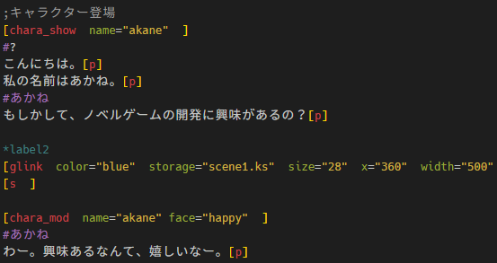

タグやラベルなどの構文が強調表示されます。

画像はMonokai Dimmedの場合です。

### タグ補完（Completion）

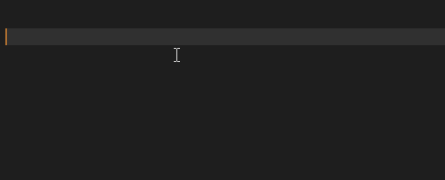

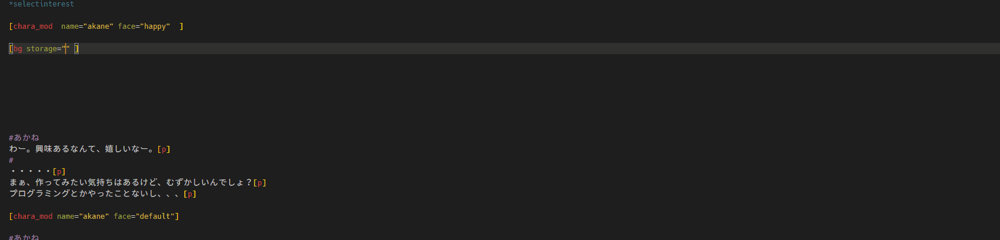

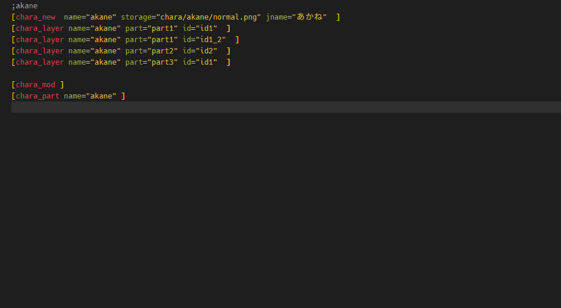

Ctrl + Spaceでタグやパラメータ、変数、ラベル、ファイルパス、chara_newタグで指定したnameやface、chara_layerタグで指定したpartやid等の補完ができます。

`macroタグ`やjsで定義したタグについても補完ができます。

### プラグイン/マクロのパラメータ補完（β版）

> [!WARNING]
> この機能は今後変更されたり削除されたりする可能性があります。

`setting.json`の`TyranoScript syntax.plugin.parameter`を変更することで、プラグインやマクロで用いるパラメータの補完ができます。

以下の点にご注意ください。

- プラグインやマクロのパラメータの値に対して、リソースのパスやchara_newタグで指定した値などは補完することができません。
- 複数プロジェクトを開いている場合、すべてのプロジェクトに対して`TyranoScript syntax.plugin.parameter`で定義したプラグイン/マクロの補完が可能になります。
- この設定で登録したプラグイン/マクロはplugin/macroタグで未定義の場合でも診断機能でエラーが出ません。
- `setting.json`の変更後は、拡張機能を再起動してください。再起動後に`setting.json`の変更が反映されます。

下記を参考にし、`setting.json`に追加してご利用ください。

（基本的に大文字の箇所とdescriptionの値を変更することで動きます。）

- `PLUGIN_NAME`をプラグインの名前やマクロの名前します。
- `parameters`で指定しているnameを、補完したいパラメータ名に変更します。
- `description`で補完したいパラメータの説明文を指定します。
- `required`で補完したいパラメータが必須かどうかを指定します。

```json
"TyranoScript syntax.plugin.parameter": {
    "PLUGIN_NAME1": {
      "name": "PLUGIN_NAME1",
      "description": "プラグインの説明文です。",
      "parameters": [
        {
          "name": "PARAMETER1",
          "required": true,
          "description": "parameterサンプルです。ここに説明文を書いてください。"
        },
        {
          "name": "PARAMETER2",
          "required": true,
          "description": ""
        }
      ]
    }
  }
```

例として、ティラノスクリプト公式より配布されている[ダイスロールプラグイン](https://plugin.tyrano.jp/item/5038)の場合以下のようになります。

```json
  "TyranoScript syntax.plugin.parameter": {
    "dice": {
      "name": "dice",
      "description": "ゲーム中でダイスを振ることができるようになります。対応ダイスは 2,3,4,6,8,10,12,20,100面ダイスです。",
      "parameters": [
        {
          "name": "roll",
          "required": true,
          "description": "実際にふるダイスを指定します（必須）。複数指定する場合は「,」カンマで区切ってください。例えば６面ダイス２個と3面ダイス１個を振りたい場合は「6,6,3」と指定できます。また「2d6,1d3」のような書き方も可能です。"
        },
        {
          "name": "result",
          "required": false,
          "description": "ダイス結果を指定できます。例えばrollで「6,6,6」と指定してresultに「1,2,3」とした場合ダイス目がそのとおりになり合計6になります。指定しない場合はランダムな数字になります。"
        },
        {
          "name": "output",
          "required": false,
          "description": "ダイス結果を格納する変数を指定できます。例えば「f.dice_result」のようにしておくことで結果を変数に格納することができます。"
        },
        {
          "name": "output_array",
          "required": false,
          "description": "ダイス結果について、個々のダイス目を格納する変数を指定できます。例えば3d6を降った場合に4,2,6 といった感じの配列が格納されます。"
        },
        {
          "name": "layer",
          "required": false,
          "description": "ダイスを表示するレイヤを指定できます。デフォルトは０"
        },
        {
          "name": "scale",
          "required": false,
          "description": "ダイスの大きさを指定できます。デフォルトは1.5。ゲームの画面サイズによって適切な値は変わってきますので適宜調整をお願いします。"
        },
        {
          "name": "skiproll",
          "required": false,
          "description": "trueを指定するとダイスをふる演出をスキップできます。結果だけが変数に格納されます。デフォルトはfalse。"
        },
        {
          "name": "min_left",
          "required": false,
          "description": "ダイスが転がる範囲の左端を指定します。中央からの相対距離を指定します。デフォルトは-450。"
        },
        {
          "name": "max_left",
          "required": false,
          "description": "ダイスが転がる範囲の右端を指定します。中央からの相対距離を指定します。デフォルトは150。"
        },
        {
          "name": "min_top",
          "required": false,
          "description": "ダイスが転がる範囲の上端を指定します。中央からの相対距離を指定します。デフォルトは-150。"
        },
        {
          "name": "max_top",
          "required": false,
          "description": "ダイスが転がる範囲の下端を指定します。中央からの相対距離を指定します。デフォルトは50。"
        }
      ]
    },
    "dice_hide": {
      "name": "dice_hide",
      "description": "画面上のダイスを非表示にします。timeパラメータは消える時間をミリ秒で指定できます。",
      "parameters": [
        {
          "name": "time",
          "required": false,
          "description": "パラメータが消える時間をミリ秒で指定できます。"
        }
      ]
    }
  }
```

### アウトライン表示(Outline)

#### タグや変数のアウトライン表示

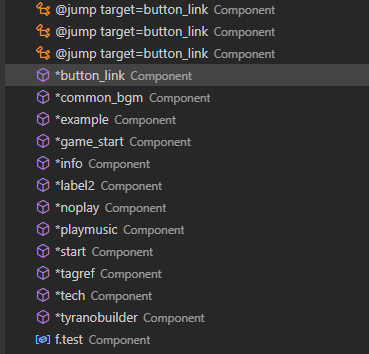

ラベルや変数、一部のタグがアウトラインビューに表示されます。
現在アウトラインタグで表示されるタグは以下です。

（設定の`TyranoScript syntax.outline.tag`から変更可能）

- ifタグ
- elseifタグ
- elseタグ
- endif
- ignore
- endignore
- jumpタグ
- callタグ
- buttonタグ
- glinkタグ
- linkタグ
- iscriptタグ
- endscriptタグ
- loadjsタグ
- htmlタグ
- endhtmlタグ

#### コメントのアウトライン表示

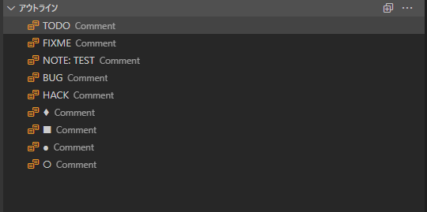

`;`でコメントアウトした行で、`TyranoScript syntax.outline.comment`で定義した文字列のいずれかが先頭の場合アウトラインに表示されます。

```tyrano
;■ここにマクロ群の定義
[macro name="test"]
[endmacro]
```

なお、デフォルトで定義された文字列は以下です。必要に応じて設定から編集してください。

- TODO
- FIXME
- NOTE
- BUG
- HACK
- ♦
- ■
- ●
- ○


### 診断機能(Diagnostics)

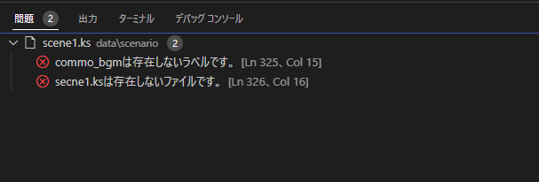

設定からAutoDiagnosticがONをしている場合、文字入力時にエラーを検出します。

現在検出できるエラーは以下です。

- ジャンプ系（"jump", "call", "link", "button", "glink", "clickable"）タグにてstorage,targetで指定した先が存在するかどうかの検出
- ジャンプ系タグのstorage,targetに変数を使用する場合、先頭に&があるかどうかの検出(&がない場合エラー)
- 使用しているタグがプロジェクトに存在するかの検出
- 使用している画像、音声などのリソースがプロジェクトに存在するかの検出
- ラベル名が正しいかどうかの検出
- マクロの重複定義の検出

f不要な場合、設定から`TyranoScript syntax.execute.diagnostic`の値を変更してください。

以下のように定義されていますので、不要なキーの値をfalseに変更しvscodeを再起動することで診断機能をOFFにできます。

```json
  "TyranoScript syntax.execute.diagnostic": {
    "undefinedMacro": true,
    "missingScenariosAndLabels": true,
    "jumpAndCallInIfStatement": true,
    "existResource": true,
    "labelName": true,
    "macroDuplicate": true,
    "undefinedParameter": true,
    "parameterSpacing": true,
    "missingAmpersandInVariable": true
  }
```

### ドキュメントツールチップ表示（Hover）

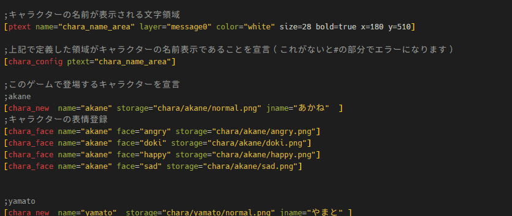

### 画像ツールチップ表示（Hover image）

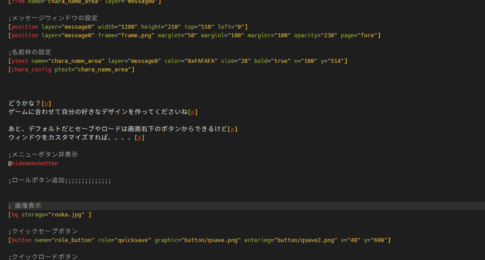

タグにマウスを乗せるとドキュメントが表示されます。

### タグのショートカット入力（Snippets）

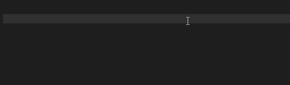

一部のタグ、記号はショートカットキーで入力できます。

- \[l][r] shift + enter
- [p] ctrl + enter（Macならcmd+enter）
- \#  alt + enter（Macならoption+enter）

入力する文字を変更したい場合は設定の`TyranoScript syntax.keyboard.alt + enter(option + enter)`等から変更してください。

### ジャンプ先へ移動（Go To Jump）

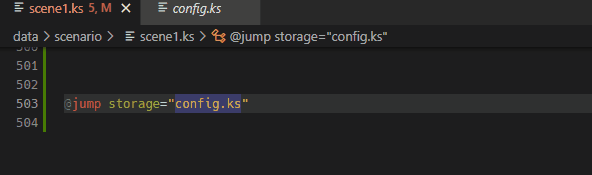

`alt + J(option + J)`でjumpなどのタグで指定したstorage,target先へとジャンプできます。

### 定義へ移動（Go To Definition）

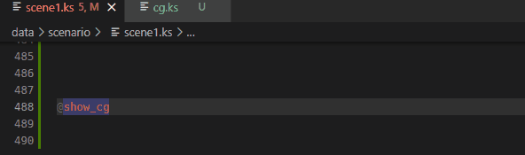

`F12`を押したとき、マクロタグで定義した箇所へジャンプできます。

### その場プレビュー機能（β版）

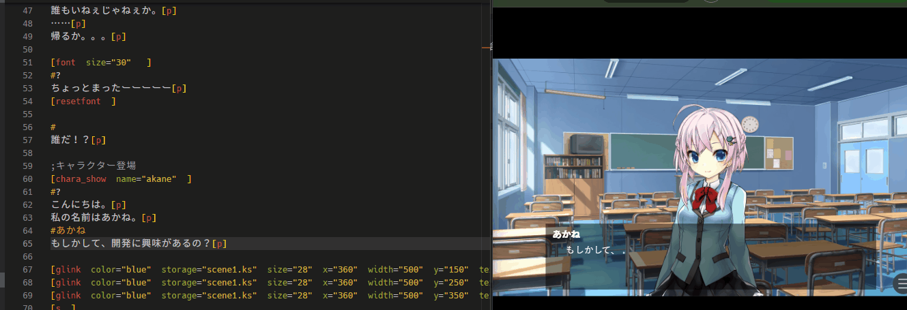

`ctrl + alt + P`で現在カーソル位置のプレビューを開くことができます。

以下の条件でプレビューが開きます。

- 現在開いているファイルの、カーソルより前の行にある最も近いラベルから処理が開始します。
- 現在開いているカーソルの位置で処理が停止します。クリックすると処理が再開します。
- 上記により、ラベル内で定義していない変数などは未定義として扱われてしまいます。
- そのため、プレビュー時に事前に変数定義や`[chara_new]`タグなどの設定をしたい場合、以下の手順を踏んでください。
  - 任意の.ksファイルに変数定義や`[chara_new]`タグなどの設定を記述する
  - 設定から`TyranoScript syntax.preview.preprocess`にその.ksファイルのscenarioフォルダから始まる相対パス、もしくは絶対パスを入力する
  - `TyranoScript syntax.preview.preprocess`で設定したファイル内でjumpタグを使わないでください。プレビューが正しく起動しなくなります。
  - 以下はその例です。
  ```preview_init.ks
  ;その場プレビューで事前に定義するキャラ、変数

  ;このゲームで登場するキャラクターを宣言
  ;akane
  [chara_new  name="akane" storage="chara/akane/normal.png" jname="あかね"  ]
  ;キャラクターの表情登録
  [chara_face name="akane" face="angry" storage="chara/akane/angry.png"]
  [chara_face name="akane" face="doki" storage="chara/akane/doki.png"]
  [chara_face name="akane" face="happy" storage="chara/akane/happy.png"]
  [chara_face name="akane" face="sad" storage="chara/akane/sad.png"]

  ;yamato
  [chara_new  name="yamato"  storage="chara/yamato/normal.png" jname="やまと" ]

  [call storage="macro_define.ks"]

  [if exp="tf.TYRANO_SYNTAX_PREVIEW==true"]
    ;メッセージウィンドウの設定
    [position layer="message0" left=160 top=500 width=1000 height=200 page=fore visible=true]
  [endif]

  ;変数の初期化
  [iscript ]
    f.hoge=0;
    f.fuga="piyo"
  [endscript ]
  ```

- `tf.TYRANO_SYNTAX_PREVIEW = true`が事前に定義されています。「ラベル開始直後に`position`タグがないけどその場プレビューでメッセージ表示させたい！」等といった場合に`if`タグなどで必要な処理を記述してください。
- カーソル位置より前に存在するBGM,SEは再生されません。
  - ただし、カーソル位置より後ろのBGM,SEは再生されます。

> [!NOTE]
> `TyranoScript syntax.preview.preprocess`はプレビューを開いたときに一度だけ更新されます。<br>
> そのため、`TyranoScript syntax.preview.preprocess`で読み込むファイルに更新を加えた場合は再度`ctrl + alt + P`でプレビューを開いてください。

> [!WARNING]
> ポート番号3100を使用しています。他のアプリケーションで使用している場合にはご注意ください。<br>
> また、この機能は今後変更されたりする可能性があります。

### フローチャート表示

`ctrl + alt + F`で現在開いているファイルのフローチャートを表示することができます。

ブラウザでlocalhost:3200/flowchart-list.htmlにアクセスすることシナリオ一覧へのリンクが表示されます。

フローチャートを見たいファイルのリンクをクリックしてください。


- ラベルを指定していない箇所は`NONE`と表示されます
- cond属性を指定している場合のみ、条件式が表示されます

> [!WARNING]
> ポート番号3200を使用しています。他のアプリケーションで使用している場合にはご注意ください。

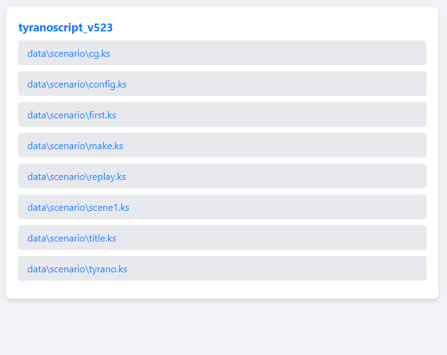
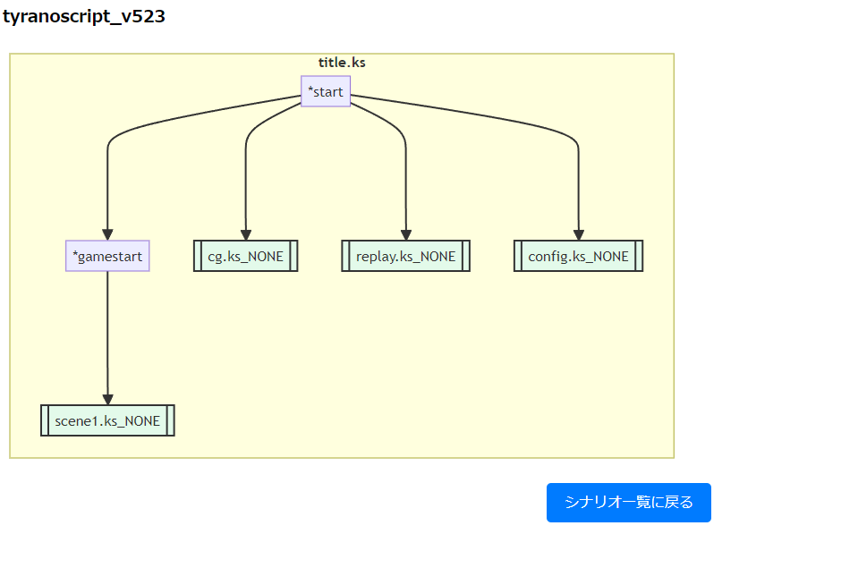

### 処理のフォールディング（折り畳み）

`region`と`endregion`で囲まれた範囲を折り畳むことができます。

以下のような記述を行うことで、折り畳むことができます。
```tyrano
; region
[p]
"This line can be folded."
; endregion
```

### 変数のリネーム機能

F2で変数やマクロをリネームできます。
リネームできるものは以下です。

- 変数
- マクロ

## ショートカット一覧

- Ctrl + Space : タグや変数などの補完
- F12 : タグの定義元へ移動
- Alt + J : jump系タグのジャンプ先へ移動
- Ctrl + Alt + P : プレビュー機能（β版）
- Ctrl + Alt + F : フローチャート表示
- Ctrl + / : コメントアウト

## 設定ファイルについて

TyranoScript_syntaxの一部機能は設定ファイルから変更を行うことができます。

特にマクロタグやjsから定義したタグの補完やファイルジャンプを行う場合、設定ファイルを見直してください。

### 言語設定

TyranoScript syntax.languageでタグ補完、ツールチップの言語設定を変更することができます。

日本語と英語にのみ対応しています。

You can change the language settings for tag completion and tooltips with TyranoScript syntax.language.
Only Japanese and English are supported.

## ティラノビルダーとの併用について

ティラノビルダーと本拡張機能を併用する場合は`TyranoScript syntax.tyranoBuilder.enabled`をtrueにしてください。
ティラノビルダー固有のパラメータなどでエラーが出なくなります。

## Release Notes

変更点については以下のリンクをご確認ください。
[CHANGELOG.md](CHANGELOG.md)

## アイコン提供

（敬称略）
アポ（@apo490）

## ライセンス/クレジット

本拡張機能は以下のライブラリを使用しています。
（以下、敬称略）

### 爆速スキッププラグイン

製作者：さくた
サークル：さくさくぷんた
X（旧twitter）：@skt_tyrano
HP：https://skskpnt.app

### mermaid-js

The MIT License (MIT)

Copyright (c) 2014 - 2022 Knut Sveidqvist

Permission is hereby granted, free of charge, to any person obtaining a copy
of this software and associated documentation files (the "Software"), to deal
in the Software without restriction, including without limitation the rights
to use, copy, modify, merge, publish, distribute, sublicense, and/or sell
copies of the Software, and to permit persons to whom the Software is
furnished to do so, subject to the following conditions:

The above copyright notice and this permission notice shall be included in all
copies or substantial portions of the Software.

THE SOFTWARE IS PROVIDED "AS IS", WITHOUT WARRANTY OF ANY KIND, EXPRESS OR
IMPLIED, INCLUDING BUT NOT LIMITED TO THE WARRANTIES OF MERCHANTABILITY,
FITNESS FOR A PARTICULAR PURPOSE AND NONINFRINGEMENT. IN NO EVENT SHALL THE
AUTHORS OR COPYRIGHT HOLDERS BE LIABLE FOR ANY CLAIM, DAMAGES OR OTHER
LIABILITY, WHETHER IN AN ACTION OF CONTRACT, TORT OR OTHERWISE, ARISING FROM,
OUT OF OR IN CONNECTION WITH THE SOFTWARE OR THE USE OR OTHER DEALINGS IN THE
SOFTWARE.

## 免責事項

本ツールを利用したことによって損害・不利益・事故等が
発生した場合でも、一切の責任を負いません。
