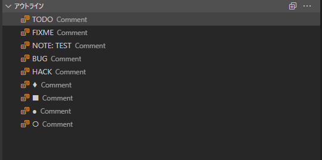

# TyranoScript_syntax

This is an extension that supports game development with [TyranoScript](https://tyrano.jp/).

## Donation Request

This extension is developed as open source and is available for free.
If you would like to support the continued development and further improvement of features, please consider making a donation.
Your support encourages us to create better tools.

<a href="https://ofuse.me/orukred/letter" target="_blank">
  
  
</a>

## Bug Reports and Feature Requests

We welcome bug reports and feature requests!
Please report using one of the following methods.

- [Report via Google Form](https://forms.gle/PnWAzHiN8MYKhUrG6)
- [Reply or DM on Twitter (@orukred)](https://twitter.com/OrukRed)
- [Create an issue on Github (bugs only)](https://github.com/orukRed/tyranosyntax/issues)

## How to use

From vscode's `File` → `Open Folder`,
select the folder where TyranoScript's `index.html` is located.

After that, when you open a file with the `.ks` extension,
if you see a notification that `TyranoScript syntax initialization has been completed. `, the extension has been loaded correctly.

*Some features, such as syntax highlighting, can be used without following the steps above.

## Features

### Syntax Highlighting


Syntax such as tags and labels is highlighted.
The image shows Monokai Dimmed.

### Tag completion


You can use Ctrl + Space to complete tags, parameters, variables, labels, file paths, names and faces specified in the chara_new tag, and parts and ids specified in the chara_layer tag.
You can also complete tags defined in `macro tags` and js.

### Completion of plugin/macro parameters (beta version)

> [!WARNING]
> This function may be changed or removed in the future.

You can complete parameters used in plugins and macros by changing `TyranoScript syntax.plugin.parameter` in `setting.json`.

Please note the following points.

- Resource paths and values ​​specified in the chara_new tag cannot be completed for plugin or macro parameter values.

- If multiple projects are open, the plugins/macros defined in `TyranoScript syntax.plugin.parameter` can be completed for all projects.

- The plugins/macros registered with this setting will not generate errors in the diagnostic function even if they are undefined in the plugin/macro tag.

- After changing `setting.json`, restart the extension. The changes in `setting.json` will be reflected after restarting.

Please refer to the following and add it to `setting.json` and use it.

(Basically, it works by changing the capitalized parts and the value of description.)

- Set `PLUGIN_NAME` to the name of the plugin or macro.

- Change the name specified in `parameters` to the name of the parameter you want to complete.

- Specify the description of the parameter you want to complete in `description`.

- Specify whether the parameter you want to complete is required or not in `required`.


```json
"TyranoScript syntax.plugin.parameter": {
    "PLUGIN_NAME1": {
      "name": "PLUGIN_NAME1",
      "description": "プラグインの説明文です。",
      "parameters": [
        {
          "name": "PARAMETER1",
          "required": true,
          "description": "parameterサンプルです。ここに説明文を書いてください。"
        },
        {
          "name": "PARAMETER2",
          "required": true,
          "description": ""
        }
      ]
    }
  }
```

例として、ティラノスクリプト公式より配布されている[ダイスロールプラグイン](https://plugin.tyrano.jp/item/5038)の場合以下のようになります。

```json
  "TyranoScript syntax.plugin.parameter": {
    "dice": {
      "name": "dice",
      "description": "ゲーム中でダイスを振ることができるようになります。対応ダイスは 2,3,4,6,8,10,12,20,100面ダイスです。",
      "parameters": [
        {
          "name": "roll",
          "required": true,
          "description": "実際にふるダイスを指定します（必須）。複数指定する場合は「,」カンマで区切ってください。例えば６面ダイス２個と3面ダイス１個を振りたい場合は「6,6,3」と指定できます。また「2d6,1d3」のような書き方も可能です。"
        },
        {
          "name": "result",
          "required": false,
          "description": "ダイス結果を指定できます。例えばrollで「6,6,6」と指定してresultに「1,2,3」とした場合ダイス目がそのとおりになり合計6になります。指定しない場合はランダムな数字になります。"
        },
        {
          "name": "output",
          "required": false,
          "description": "ダイス結果を格納する変数を指定できます。例えば「f.dice_result」のようにしておくことで結果を変数に格納することができます。"
        },
        {
          "name": "output_array",
          "required": false,
          "description": "ダイス結果について、個々のダイス目を格納する変数を指定できます。例えば3d6を降った場合に4,2,6 といった感じの配列が格納されます。"
        },
        {
          "name": "layer",
          "required": false,
          "description": "ダイスを表示するレイヤを指定できます。デフォルトは０"
        },
        {
          "name": "scale",
          "required": false,
          "description": "ダイスの大きさを指定できます。デフォルトは1.5。ゲームの画面サイズによって適切な値は変わってきますので適宜調整をお願いします。"
        },
        {
          "name": "skiproll",
          "required": false,
          "description": "trueを指定するとダイスをふる演出をスキップできます。結果だけが変数に格納されます。デフォルトはfalse。"
        },
        {
          "name": "min_left",
          "required": false,
          "description": "ダイスが転がる範囲の左端を指定します。中央からの相対距離を指定します。デフォルトは-450。"
        },
        {
          "name": "max_left",
          "required": false,
          "description": "ダイスが転がる範囲の右端を指定します。中央からの相対距離を指定します。デフォルトは150。"
        },
        {
          "name": "min_top",
          "required": false,
          "description": "ダイスが転がる範囲の上端を指定します。中央からの相対距離を指定します。デフォルトは-150。"
        },
        {
          "name": "max_top",
          "required": false,
          "description": "ダイスが転がる範囲の下端を指定します。中央からの相対距離を指定します。デフォルトは50。"
        }
      ]
    },
    "dice_hide": {
      "name": "dice_hide",
      "description": "画面上のダイスを非表示にします。timeパラメータは消える時間をミリ秒で指定できます。",
      "parameters": [
        {
          "name": "time",
          "required": false,
          "description": "パラメータが消える時間をミリ秒で指定できます。"
        }
      ]
    }
  }
```

### Outline display

#### Tag and Variable Outline Display


Labels, variables, and some tags are displayed in the outline view.

The tags currently displayed in the outline tag are as follows.

(Can be changed from `TyranoScript syntax.outline.tag` in the settings)

- if tag
- elseif tag
- else tag
- endif
- ignore
- endignore
- jump tag
- call tag
- button tag
- glink tag
- link tag
- iscript tag
- endscript tag
- loadjs tag
- html tag
- endhtml tag

#### Comment Outline Display



Comments starting with `;` will be displayed in the outline if they begin with any of the strings defined in `TyranoScript syntax.outline.comment`.

```tyrano
;■Define macro group here
[macro name="test"]
[endmacro]
```

The default defined strings are as follows. You can edit them from the settings as needed.

- TODO
- FIXME
- NOTE
- BUG
- HACK
- ♦
- ■
- ●
- ○

### Diagnostics


If AutoDiagnostic is turned on in the settings, errors will be detected when entering text.

Currently, the following errors can be detected.

- Detects whether the destination specified by storage and target exists in jump tags ("jump", "call", "link", "button", "glink", "clickable")
- Detects whether there is an & at the beginning when using variables in storage and target of jump tags (error occurs if there is no &)
- Detects whether the tag being used exists in the project
- Detects whether resources such as images and audio used in the project exist
- Detects whether label names are correct
- Detects duplicate macro definitions

If not required, change the value of `TyranoScript syntax.execute.diagnostic` from the settings.

It is defined as follows, so you can turn off the diagnostic function by changing the value of unnecessary keys to false and restarting vscode.

```json
  "TyranoScript syntax.execute.diagnostic": {
    "undefinedMacro": true,
    "missingScenariosAndLabels": true,
    "jumpAndCallInIfStatement": true,
    "existResource": true,
    "labelName": true,
    "macroDuplicate": true,
    "undefinedParameter": true,
    "parameterSpacing": true,
    "missingAmpersandInVariable": true
  }
```

### Display document tooltip (Hover)


### Display image tooltip (Hover image)


Hover the mouse over a tag to display the document.

### Tag shortcut input (Snippets)


Some tags and symbols can be entered using shortcut keys.

- \[l][r] shift + enter
- [p] ctrl + enter (cmd+enter on Mac)
- \# alt + enter (option+enter on Mac)

If you want to change the characters you enter, change them in the settings, such as `TyranoScript syntax.keyboard.alt + enter(option + enter)`.

### Go To Jump


`alt + J(option + J)` allows you to jump to the storage or target specified by tags such as jump.

### Go To Definition


When you press `F12`, you can jump to the location defined by the macro tag.

### On-the-fly preview function (beta version)


`ctrl + alt + P` opens a preview of the current cursor position.

The preview opens under the following conditions.

- Processing will start from the closest label on the line before the cursor in the currently open file.
- Processing will stop at the currently open cursor position. Click to resume processing.
- Due to the above, variables that are not defined in the label will be treated as undefined.
- Therefore, if you want to define variables, set `[chara_new]` tags, etc. before previewing, follow the steps below.
  - Write the variable definitions, `[chara_new]` tags, etc. settings in any .ks file
  - Enter the relative path starting from the scenario folder or the absolute path of that .ks file in `TyranoScript syntax.preview.preprocess` from the settings
  - Do not use jump tags in the files set by `TyranoScript syntax.preview.preprocess`, as this will prevent the preview from launching correctly.
  - Below is an example.
  ```preview_init.ks
  ;Characters and variables to predefine in on-the-fly preview

  ;Declares the characters that will appear in this game
  ;akane
  [chara_new  name="akane" storage="chara/akane/normal.png" jname="Akane"  ]
  ;Registers character facial expressions
  [chara_face name="akane" face="angry" storage="chara/akane/angry.png"]
  [chara_face name="akane" face="doki" storage="chara/akane/doki.png"]
  [chara_face name="akane" face="happy" storage="chara/akane/happy.png"]
  [chara_face name="akane" face="sad" storage="chara/akane/sad.png"]

  ;yamato
  [chara_new  name="yamato"  storage="chara/yamato/normal.png" jname="Yamato" ]

  [call storage="macro_define.ks"]

  [if exp="tf.TYRANO_SYNTAX_PREVIEW==true"]
    ;Message window settings
    [position layer="message0" left=160 top=500 width=1000 height=200 page=fore visible=true]
  [endif]

  ;Initialize variables
  [iscript ]
    f.hoge=0;
    f.fuga="piyo"
  [endscript ]
  ```

- `tf.TYRANO_SYNTAX_PREVIEW = true` is predefined. If you want to display a message in the instant preview even though there is no `position` tag immediately after the label start, please write the necessary processing using `if` tags, etc.
- BGM and SE that exist before the cursor position will not be played.
  - However, BGM and SE after the cursor position will be played.

> [!NOTE]
> `TyranoScript syntax.preview.preprocess` is updated only once when the preview is opened. <br>
> Therefore, if you make any updates to the file loaded by `TyranoScript syntax.preview.preprocess`, please open the preview again with `ctrl + alt + P`.

> [!WARNING]
> Port number 3100 is used. Please be careful if you are using it in other applications. <br>
> This function may be changed in the future.

### Display Flowchart

You can display the flowchart of the currently open file with `ctrl + alt + F`.

Access localhost:3200/flowchart-list.html in your browser to display a link to the scenario list.

Click on the link of the file you want to see the flowchart of.


- `NONE` is displayed for places where no label is specified
- Conditional expressions are displayed only if the cond attribute is specified

> [!WARNING]
> Port number 3200 is used. Please be careful if you are using it in other applications.


### Folding a process

You can fold the range enclosed by `region` and `endregion`.

You can fold it by writing the following:
```tyrano
; region
[p]
"This line can be folded."
; endregion
```

### Variable Rename Function

You can rename variables and macros with F2.
The following can be renamed:

- Variables
- Macros

## List of shortcuts

- Ctrl + Space : Complete tags and variables
- F12 : Go to tag definition
- Alt + J : Go to jump destination of jump tag
- Ctrl + Alt + P : Preview function (beta version)
- Ctrl + Alt + F : Display flow chart
- Ctrl + / : Comment out

## About the configuration file

Some functions of TyranoScript_syntax can be changed from the configuration file.
Please review the configuration file, especially if you want to complete tags defined from macro tags or js or jump to files.

### Language Settings

You can change the language settings for tag completion and tooltips with TyranoScript syntax.language.
Only Japanese and English are supported.

## Using with Tyrano Builder

If you want to use this extension together with Tyrano Builder, please set `TyranoScript syntax.tyranoBuilder.enabled` to true.
This will prevent errors for Tyrano Builder-specific parameters.

## Release Notes

Please see the link below for changes.
[CHANGELOG.md](CHANGELOG.md)

## Icon Provider

(Honorific titles omitted)
Apo (@apo490)

## License/Credits

This extension uses the following libraries.
(Honorific titles omitted below)

### Bakusoku Skip Plugin (High-Speed Skip Plugin)

Creator: Sakuta
Circle: Sakusaku Punta
X (formerly Twitter): @skt_tyrano
HP: https://skskpnt.app

### mermaid-js

The MIT License (MIT)

Copyright (c) 2014 - 2022 Knut Sveidqvist

Permission is hereby granted, free of charge, to any person obtaining a copy
of this software and associated documentation files (the "Software"), to deal
in the Software without restriction, including without limitation the rights
to use, copy, modify, merge, publish, distribute, sublicense, and/or sell
copies of the Software, and to permit persons to whom the Software is
furnished to do so, subject to the following conditions:

The above copyright notice and this permission notice shall be included in all
copies or substantial portions of the Software.

THE SOFTWARE IS PROVIDED "AS IS", WITHOUT WARRANTY OF ANY KIND, EXPRESS OR
IMPLIED, INCLUDING BUT NOT LIMITED TO THE WARRANTIES OF MERCHANTABILITY,
FITNESS FOR A PARTICULAR PURPOSE AND NONINFRINGEMENT. IN NO EVENT SHALL THE
AUTHORS OR COPYRIGHT HOLDERS BE LIABLE FOR ANY CLAIM, DAMAGES OR OTHER
LIABILITY, WHETHER IN AN ACTION OF CONTRACT, TORT OR OTHERWISE, ARISING FROM,
OUT OF OR IN CONNECTION WITH THE SOFTWARE OR THE USE OR OTHER DEALINGS IN THE
SOFTWARE.

## Disclaimer

We are not responsible for any damage, inconvenience, or accidents that may occur as a result of using this tool.
